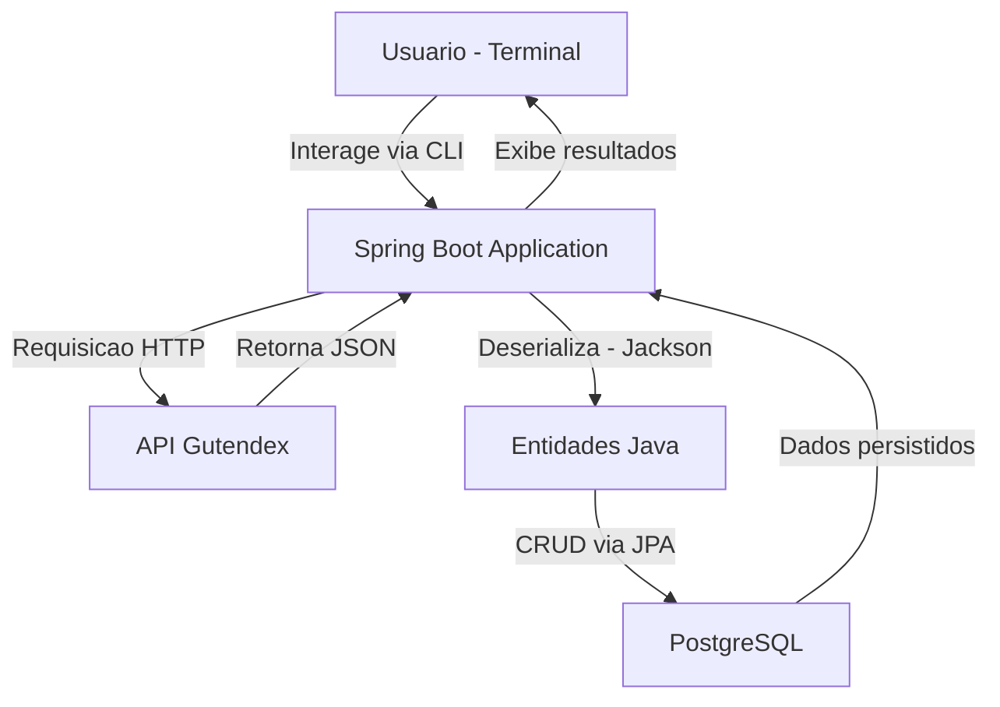

[](https://www.oracle.com/java/) [](https://spring.io/projects/spring-boot) [](https://maven.apache.org/) [](https://www.postgresql.org/)

# 📚 Literallor — Catálogo de Livros

Uma aplicação de terminal em **Java 24** + **Spring Boot 3.x** que consome a API [Gutendex](https://gutendex.com/) para buscar metadados de livros e persistir em um banco **PostgreSQL**. Ideal para quem quer explorar consumo de APIs REST, JPA e interatividade via console.

---

## 📋 Sumário

1. [Visão Geral](#-visão-geral)
2. [Tecnologias](#-tecnologias)
3. [Pré-requisitos](#-pré-requisitos)
4. [Instalação & Configuração](#-instalação--configuração)
5. [Como Executar](#-como-executar)
6. [Uso da Aplicação](#-uso-da-aplicação)
7. [Estrutura do Projeto](#-estrutura-do-projeto)
8. [Diagrama de Arquitetura](#-diagrama-de-arquitetura)
9. [Próximos Passos](#-próximos-passos)

---

## 🔍 Visão Geral

- **Objetivo**: Permitir buscas e gerenciamento de um catálogo de livros a partir do terminal.
- **Fonte de Dados**: API pública gratuita [Gutendex](https://gutendex.com/books/).
- **Persistência**: PostgreSQL via Spring Data JPA.

---

## 🛠 Tecnologias

- **Java 21**
- **Spring Boot 3.x**
- **Maven**
- **Spring Data JPA**
- **PostgreSQL**
- **Jackson** (JSON ↔ Java)
- **Gutendex API**

---

## ⚙️ Pré-requisitos

1. **JDK 21**
2. **Maven 3.x** (ou [Maven Wrapper](https://github.com/takari/maven-wrapper) incluído)
3. **PostgreSQL** em execução

---

## 🚀 Instalação & Configuração

1. **Clone o repositório**

   ```bash
   git clone https://github.com/seu-usuario/literallor.git
   cd literallor
   ```

2. **Crie o banco de dados**

   ```sql
   CREATE DATABASE literallordb;
   ```

3. **Ajuste credenciais** em `src/main/resources/application.properties`

   ```properties
   spring.datasource.url=jdbc:postgresql://localhost:5432/literallordb
   spring.datasource.username=SEU_USUARIO
   spring.datasource.password=SUA_SENHA
   spring.jpa.hibernate.ddl-auto=update   # ou 'validate' em produção
   spring.jpa.show-sql=true
   ```

---

## ▶️ Como Executar

1. No terminal, compile e execute:

   ```bash
   ./mvnw clean install
   ./mvnw spring-boot:run
   ```

2. A aplicação iniciará e apresentará o prompt de comandos no console.

---

## 💻 Uso da Aplicação

A seguir, exemplos de opções de menu no terminal (a implementar):

```
1. Buscar livro por título
2. Listar todos os livros cadastrados
3. Buscar livro por autor
4. Listar autores vivos em ano específico
5. Listar livros por idioma
0. Sair
```

---

## 📂 Estrutura do Projeto

```
.
├── src/
│   ├── main/
│   │   ├── java/com/rafallor/literallor/
│   │   │   ├── LiterallorApplication.java      # Ponto de entrada
│   │   │   └── … (modelos, serviços, repositórios)
│   │   └── resources/
│   │       └── application.properties
│   └── test/
│       └── java/com/rafallor/literallor/
│           └── LiterallorApplicationTests.java
├── pom.xml                                     # Build & dependências
└── README.md                                   # Este arquivo
```

---

## 🏛 Diagrama de Arquitetura



---

## 🚧 Próximos Passos

- [ ] Modelos de dados para entidades JPA
- [ ] Serviço de consumo com `RestTemplate` ou `WebClient`
- [ ] Implementação de repositórios e testes de unidade
- [ ] Opções avançadas de busca e filtros no terminal
- [ ] Documentação da API e scripts de migração de banco

---

<p align="center">
  <em>Desenvolvido com ♥ por Rafael Gomes Silva</em>
</p>
